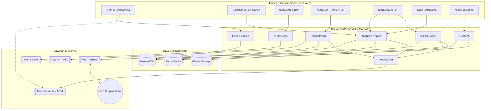
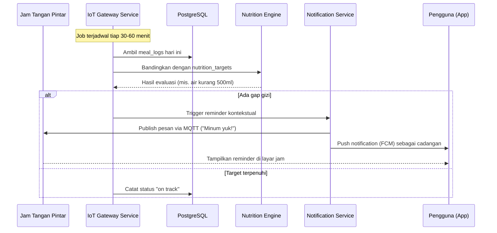
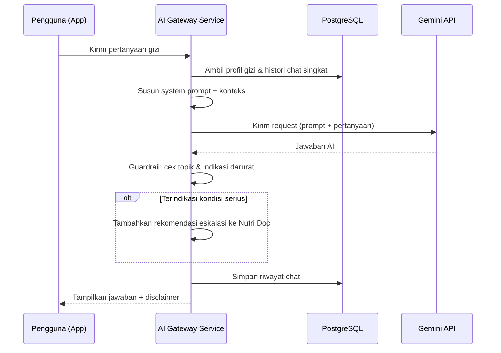
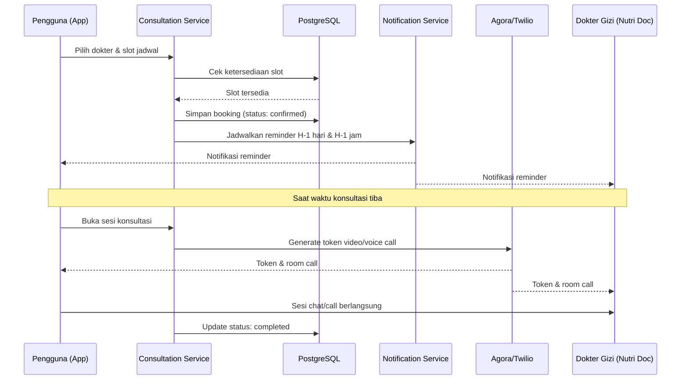
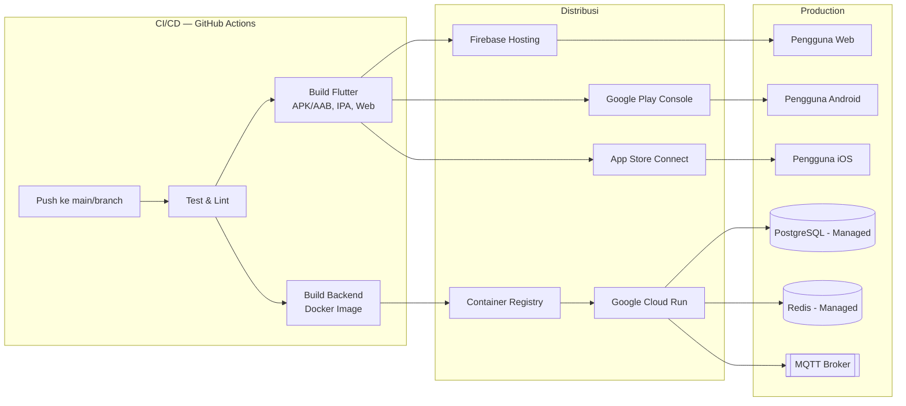

# Dokumen Arsitektur — NutriCare

**Versi:** 1.0
**Terkait:** PRD.md, TSD.md, USER_FLOW.md

Dokumen ini berisi diagram-diagram arsitektur detail yang melengkapi TSD: komponen sistem, alur data antar layanan, dan skenario integrasi utama (AI, IoT, telemedicine).

---

## 1. Diagram Komponen Tingkat Tinggi

## 2. Sequence Diagram — Alur Data IoT (Reminder Gizi Real-Time)

## 3. Sequence Diagram — Alur Nutri Mate (Gemini AI)

## 4. Sequence Diagram — Booking & Konsultasi Nutri Doc (Dokter Gizi)

## 5. Diagram Deployment / Infrastruktur

## 6. Prinsip Arsitektur yang Dipegang

1. **Client tidak pernah memanggil Gemini/Agora secara langsung** — semua kredensial pihak ketiga tersimpan di backend, client hanya bicara ke API Gateway sendiri.
2. **Modular monolith dulu, microservices kemudian** — batas modul (User, Nutrition, AI, Consultation, IoT, Content, Notification) sudah dirancang tegas agar mudah dipisah bila skala menuntut.
3. **Device adapter pattern untuk IoT** — dukungan multi-merek jam tangan tidak mengubah logika evaluasi gizi inti.
4. **Guardrail wajib di jalur AI** — setiap respons Gemini melewati filter topik & deteksi risiko sebelum sampai ke pengguna.
5. **Stateless backend** — semua state disimpan di PostgreSQL/Redis, bukan di memori service, agar scaling horizontal aman.
