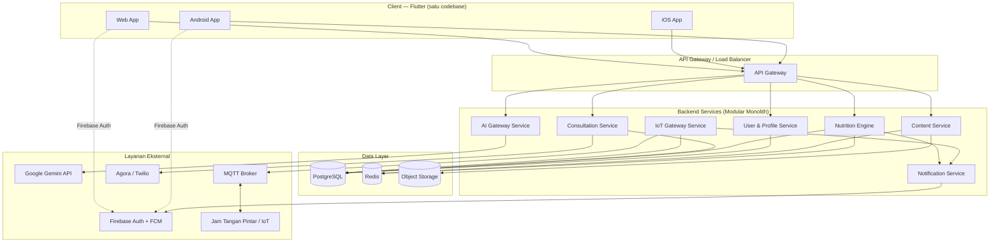
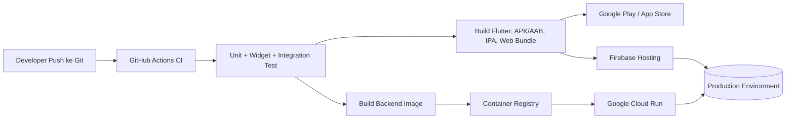

# Technical Specification Document (TSD) — NutriCare

**Versi:** 1.2
**Terkait:** PRD.md, ARCHITECTURE.md, USER_FLOW.md, ADAPTASI_SIGAP.md

---

## 1. Ringkasan Teknis

NutriCare dibangun dengan **Flutter** sebagai satu basis kode untuk Android, iOS, dan Web. Backend berupa REST API modular (modular monolith) yang mengekspos layanan profil gizi, AI gateway (Gemini), konsultasi dokter, gateway IoT, dan konten edukasi. Data disimpan di PostgreSQL, dengan Firebase digunakan untuk autentikasi, notifikasi push, dan storage konten.

## 2. Tech Stack

| Layer | Teknologi | Alasan |
|---|---|---|
| Frontend (App + Web) | Flutter 3.x | Satu codebase → Android, iOS, Web |
| State Management | Riverpod | Skalabel, testable, cocok lintas platform |
| Routing | go_router | Mendukung deep link & rantai guard route (Auth → Verifikasi → Profil Gizi) |
| Backend API | FastAPI (Python) *atau* NestJS (Node.js/TypeScript) | REST cepat dibangun, dokumentasi OpenAPI otomatis (FastAPI) |
| Database utama | PostgreSQL | Data relasional terstruktur (profil, booking, log gizi) |
| Cache | Redis | Cache target gizi, session rate-limit, & artikel populer |
| Realtime & IoT | MQTT broker (mis. EMQX/HiveMQ) | Komunikasi dua arah dengan jam tangan pintar |
| Notifikasi | Firebase Cloud Messaging (FCM) | Push notification ke app & relay ke perangkat |
| AI | Google Gemini API | Nutri Mate chatbot |
| Auth | Firebase Authentication / Backend Auth | Email/Password, Google OAuth (Apple = Fase berikutnya), verifikasi email wajib |
| Storage konten | Firebase Storage / object storage kompatibel S3 | Artikel, gambar, video edukasi |
| Video/Voice Call | Agora.io atau Twilio Video | Sesi Konsultasi Nutri Doc |
| Hosting Backend | Google Cloud Run (atau Railway/Render untuk tahap awal) | Container scalable, bayar sesuai pemakaian |
| Hosting Web | Firebase Hosting / Vercel | CDN cepat, terintegrasi PWA |
| CI/CD | GitHub Actions | Build & deploy otomatis app (apk/aab/ipa) + web + backend |
| Monitoring | Sentry (error) + Google Cloud Logging | Observability |

## 3. Arsitektur Sistem (High-Level)



## 4. Arsitektur Frontend (Flutter)

### 4.1 Struktur Folder (Clean Architecture)

```
lib/
├── core/                 # constants, theme, error handling, utils, password_policy
├── data/
│   ├── models/           # DTO / model JSON
│   ├── repositories/     # implementasi repository
│   └── datasources/      # remote (API) & local (Hive/Prefs)
├── domain/
│   ├── entities/
│   ├── repositories/     # kontrak abstrak
│   └── usecases/
├── presentation/
│   ├── screens/
│   │   ├── auth/
│   │   │   ├── auth_screen.dart               # Login & Register single card (tab toggle) + banner lockout
│   │   │   ├── email_verification_screen.dart # Verifikasi email 3 langkah + smart open email app
│   │   │   ├── reverify_screen.dart            # Verifikasi ulang saat login gagal belum aktif
│   │   │   └── forgot_password_sheet.dart      # Modal bottom sheet reset kata sandi via email
│   │   ├── onboarding_profile/
│   │   ├── home_dashboard/
│   │   ├── nutri_mate/
│   │   ├── dokter_gizi/       # Nutri Doc
│   │   ├── meal_planner/      # Nutri Meal
│   │   ├── bmi_calculator/    # Nutri Calculator
│   │   ├── health_education/  # Nutri Education
│   │   └── profil/            # Profil pengguna (diakses dari Beranda)
│   ├── widgets/
│   └── providers/        # Riverpod providers per fitur (auth_provider, nutrition_provider, dll)
├── routing/               # go_router configuration + route guard rantai
└── main.dart
```

### 4.2 Prinsip Desain
- **Clean Architecture** (data–domain–presentation) agar logika bisnis terlepas dari UI dan mudah diuji.
- **Riverpod** untuk state management lintas platform (mobile & web memakai provider yang sama).
- **Rantai Route Guard & State Machine**: Alur navigasi pra-otorisasi hingga dashboard diatur oleh state machine: `splash → onboarding → auth → email_verification → reverify → complete_profile → app`. Route guard `go_router` secara ketat memvalidasi:
  1. Pengguna belum terautentikasi → diarahkan ke `/auth`.
  2. Pengguna terdaftar via email/password tetapi belum diverifikasi → diarahkan ke `/email-verification` atau `/reverify`.
  3. Pengguna telah terverifikasi tetapi belum melengkapi profil gizi awal → diarahkan paksa ke `/onboarding-profile`.
  4. Pengguna terverifikasi dan telah memiliki profil gizi → diberikan akses ke `/` (Dashboard utama).
- **Navigasi Shell & Dock Floating**: Shell utama aplikasi menggunakan `go_router` dengan `StatefulShellRoute.indexedStack` untuk mengelola 4 tab utama pasca-onboarding (**Beranda**, **Nutri Mate**, **Nutri Meal**, **Nutri Doc**) yang menampilkan floating frosted `AppDock`. Profil, Nutri Calculator, dan Nutri Education diakses dari dalam Beranda tanpa tab terpisah di dock. Halaman detail/sub-halaman (seperti artikel detail, booking konsultasi, riwayat chat mendalam) di-push ke root navigator (`parentNavigatorKey`), sehingga menutupi dock (dock tidak tampil di halaman detail). Tombol back di pojok kiri atas muncul otomatis pada halaman non-root berdasarkan `Navigator.canPop(context)`.
- **Transisi Navigasi & CustomTransitionPage**: Pergantian halaman detail menggunakan `CustomTransitionPage` pada routing `go_router` dengan efek slide + fade 300ms yang konsisten dan berbalik arah saat kembali (pop).
- **Sistem Animasi & Motion (AppMotion)**: Animasi antarmuka halus bergaya Apple diatur via konstanta `AppMotion` (`lib/core/theme/app_motion.dart`) dengan durasi pendek (mikro-interaksi 150ms, transisi layar 300ms, data sweep 700ms) dan dibatasi pada properti GPU (`Transform` & `Opacity`). Wajib mematuhi preferensi *reduced-motion* pengguna melalui `MediaQuery.disableAnimationsOf(context)` (durasi 0ms/instant).
- **Responsive layout**: `LayoutBuilder`/breakpoint khusus web agar dashboard, chat, dan Nutri Meal nyaman di layar lebar.
- **Local cache** (Hive/SharedPreferences) untuk profil, draft registrasi (TTL 30 menit), & sesi agar app tetap responsif saat offline sebentar.

## 5. Arsitektur Backend

### 5.1 Pola: Modular Monolith
Dimulai sebagai monolith modular (mudah dikembangkan tim kecil), dengan batas modul yang jelas agar bisa dipecah menjadi microservices saat skala membesar.

**Modul:**
- **User & Profile Service** — registrasi, profil, autentikasi lanjutan, lockout counter, gamifikasi privat (streak, poin, pencapaian)
- **Nutrition Engine** — hitung target gizi harian, Nutri Calculator (BMI)
- **AI Gateway Service** — proxy ke Gemini, prompt engineering, guardrail, rate limiting (Nutri Mate)
- **Consultation Service** — booking, chat, generate token video call (Nutri Doc)
- **IoT Gateway Service** — terima data dari MQTT, evaluasi target gizi realtime, trigger reminder (Nutri Meal + IoT)
- **Content Service** — CMS artikel/video edukasi + kurikulum berjenjang, bank soal kuis/ujian, sertifikat (Nutri Education)
- **Notification Service** — orkestrasi FCM & pesan ke perangkat IoT

### 5.2 Contoh Endpoint API (REST)

| Method | Endpoint | Deskripsi |
|---|---|---|
| POST | `/api/v1/auth/register` | Registrasi akun baru (email/password atau Google) |
| POST | `/api/v1/auth/login` | Autentikasi pengguna & validasi verifikasi email |
| POST | `/api/v1/auth/send-verification` | Kirim / kirim ulang link aktivasi & verifikasi email |
| POST | `/api/v1/auth/reset-password` | Permintaan reset kata sandi via email |
| POST | `/api/v1/profile` | Simpan/perbarui profil gizi |
| GET | `/api/v1/profile/nutrition-target` | Ambil target gizi harian terhitung |
| POST | `/api/v1/nutri-mate/chat` | Kirim pertanyaan ke Nutri Mate (Gemini) |
| GET | `/api/v1/nutri-mate/history` | Riwayat chat |
| GET | `/api/v1/doctors` | Daftar dokter gizi mitra (Nutri Doc) |
| POST | `/api/v1/consultations/book` | Booking jadwal konsultasi |
| GET | `/api/v1/consultations/{id}` | Detail konsultasi (termasuk token call) |
| POST | `/api/v1/meal-log` | Catat asupan makanan/minuman manual |
| GET | `/api/v1/meal-log/today-summary` | Ringkasan progres gizi hari ini |
| POST | `/api/v1/devices/pair` | Pairing jam tangan pintar |
| POST | `/api/v1/devices/{id}/ack` | Update status dari perangkat IoT |
| GET | `/api/v1/bmi/calculate` | Hitung BMI (Nutri Calculator) |
| GET | `/api/v1/education/articles` | Daftar artikel/video edukasi (Nutri Education) |
| GET | `/api/v1/education/modules` | Kurikulum berjenjang (Fase 2) |
| GET | `/api/v1/education/modules/{id}` | Detail modul + materi (Fase 2) |
| POST | `/api/v1/education/modules/{id}/progress` | Tandai modul selesai (Fase 2) |
| GET | `/api/v1/education/quizzes/{moduleId}` | Soal kuis/flashcards modul (Fase 2) |
| POST | `/api/v1/education/quizzes/{moduleId}/attempts` | Submit skor kuis/simulasi ujian (Fase 2) |
| GET | `/api/v1/education/certificates` | Sertifikat privat pengguna (Fase 2) |
| GET | `/api/v1/user/progress` | Streak, poin, pencapaian pribadi (Fase 2) |
| PUT | `/api/v1/user/progress/reminder-settings` | Atur reminder target harian (Fase 2) |

### 5.3 Autentikasi & Otorisasi
- Autentikasi mendukung **Email/Password** dan **Google OAuth** (Apple OAuth dijadwalkan pada Fase berikutnya).
- **Email Verification Gate**: Akun berbasis email/password wajib diverifikasi sebelum mendapatkan hak akses penuh ke data gizi atau konsultasi medis. Akun via Google OAuth terverifikasi secara otomatis.
- **Proteksi Brute-Force & Rate Limiting**: Batas 5 kali percobaan login gagal berturut-turut memicu penguncian sementara akun (*lockout*) selama 5 menit dengan countdown timer di sisi klien. Pengiriman email verifikasi dibatasi cooldown 60 detik.
- **Kebijakan Kata Sandi (5 Kriteria)**: Minimal 8 karakter, kombinasi huruf kapital, huruf kecil, angka, dan karakter khusus/simbol.
- **Role-based access**: Default `user`, serta `dokter_gizi`, `admin_konten`, `admin_sistem`.

## 6. Skema Database (ERD)

```mermaid
erDiagram
    USERS ||--o| NUTRITION_PROFILES : has
    USERS ||--o{ MEAL_LOGS : records
    USERS ||--o{ CONSULTATIONS : books
    USERS ||--o{ CHAT_MESSAGES : sends
    USERS ||--o{ DEVICE_PAIRINGS : owns
    USERS ||--o{ SAVED_ARTICLES : bookmarks
    USERS ||--o{ USER_PROGRESS : tracks
    USERS ||--o{ MODULE_PROGRESS : completes
    USERS ||--o{ QUIZ_ATTEMPTS : takes
    USERS ||--o{ CERTIFICATES : earns
    DOCTORS ||--o{ CONSULTATIONS : handles
    ARTICLES ||--o{ SAVED_ARTICLES : referenced_by
    NUTRITION_PROFILES ||--|| NUTRITION_TARGETS : generates
    STUDY_MODULES ||--o{ QUIZ_QUESTIONS : contains
    STUDY_MODULES ||--o{ MODULE_PROGRESS : tracks
    STUDY_MODULES ||--o{ QUIZ_ATTEMPTS : referenced_by

    USERS {
        uuid id PK
        string name
        string email
        string phone
        boolean email_verified
        string auth_provider
        string role
        datetime created_at
    }
    NUTRITION_PROFILES {
        uuid id PK
        uuid user_id FK
        int age
        string gender
        float height_cm
        float weight_kg
        string activity_level
        datetime updated_at
    }
    NUTRITION_TARGETS {
        uuid id PK
        uuid profile_id FK
        float calorie_target
        float protein_g
        float carb_g
        float fat_g
        float water_ml
    }
    MEAL_LOGS {
        uuid id PK
        uuid user_id FK
        string item_name
        float calorie
        float sugar_g
        float water_ml
        datetime logged_at
    }
    USER_PROGRESS {
        uuid id PK
        uuid user_id FK
        int streak_days
        int total_points
        json badges
        json reminder_settings
        datetime updated_at
    }
    STUDY_MODULES {
        uuid id PK
        string title
        string category
        int tier
        string content_url
        datetime published_at
    }
    QUIZ_QUESTIONS {
        uuid id PK
        uuid module_id FK
        string question
        json options
        string correct_answer
    }
    MODULE_PROGRESS {
        uuid user_id FK
        uuid module_id FK
        string status
        datetime completed_at
    }
    QUIZ_ATTEMPTS {
        uuid id PK
        uuid user_id FK
        uuid module_id FK
        int score
        int max_score
        boolean passed
        datetime attempted_at
    }
    CERTIFICATES {
        uuid id PK
        uuid user_id FK
        string title
        datetime issued_at
    }
    DOCTORS {
        uuid id PK
        string name
        string specialty
        string affiliation
        float rating
    }
    CONSULTATIONS {
        uuid id PK
        uuid user_id FK
        uuid doctor_id FK
        datetime scheduled_at
        string status
        string call_token
    }
    CHAT_MESSAGES {
        uuid id PK
        uuid user_id FK
        string sender
        text message
        datetime sent_at
    }
    DEVICE_PAIRINGS {
        uuid id PK
        uuid user_id FK
        string device_id
        string device_type
        datetime paired_at
    }
    ARTICLES {
        uuid id PK
        string title
        string category
        string content_url
    }
    SAVED_ARTICLES {
        uuid user_id FK
        uuid article_id FK
    }
```



## 7. Integrasi Gemini AI (Nutri Mate)

**Alur:**
1. Pengguna mengetik pertanyaan di UI chat Nutri Mate.
2. App mengirim request ke `AI Gateway Service` di backend (bukan langsung ke Gemini, agar API key tidak terekspos di client).
3. Backend menyusun prompt: system prompt (peran sebagai asisten gizi) + konteks profil gizi pengguna (umur, target kalori, kondisi khusus bila ada) + histori percakapan singkat.
4. Backend memanggil Gemini API, menunggu respons.
5. Backend menjalankan **guardrail**: filter topik di luar gizi/kesehatan, deteksi indikasi kondisi darurat/serius → jika terdeteksi, tambahkan rekomendasi eskalasi ke Nutri Doc.
6. Jawaban dikirim kembali ke app dan disimpan sebagai riwayat chat.

**Pertimbangan teknis:**
- Rate limiting per pengguna untuk mengontrol biaya API.
- Caching jawaban untuk pertanyaan umum yang sering muncul (FAQ gizi).
- Logging prompt & respons (tanpa data sensitif) untuk evaluasi kualitas jawaban.

## 8. Integrasi IoT (Jam Tangan Pintar)

**Alur:**
1. Pairing awal dilakukan lewat Bluetooth Low Energy (BLE) dari app ke jam tangan.
2. Setelah terpasang, jam tangan berkomunikasi ke backend baik langsung via WiFi+MQTT, atau melalui app sebagai relay BLE→HTTP (tergantung kapabilitas perangkat).
3. `IoT Gateway Service` menjalankan job terjadwal (misal setiap 30–60 menit) yang membandingkan `meal_logs` hari berjalan terhadap `nutrition_targets`.
4. Jika ditemukan gap (misal asupan air kurang), sistem mem-publish pesan reminder ke topic MQTT milik perangkat tersebut, atau mengirim via FCM yang diteruskan app ke jam.
5. Jam tangan menampilkan notifikasi kontekstual (mis. "Minum yuk!").

**Catatan desain:** karena ketergantungan pada SDK vendor jam tangan bervariasi, modul ini dirancang dengan **interface adapter** (`DeviceAdapter`) sehingga penambahan dukungan merek jam baru tidak mengubah logika inti evaluasi gizi.

## 9. Integrasi Nutri Doc (Telemedicine Dokter Gizi Online)

- **Booking**: `Consultation Service` mengecek ketersediaan slot dokter (kalender internal), menyimpan booking, menjadwalkan reminder (H-1 hari & H-1 jam) lewat `Notification Service`.
- **Chat**: realtime menggunakan WebSocket atau Firestore listener, tersimpan di tabel `chat_messages`.
- **Video/Voice Call**: token sesi digenerate dari SDK pihak ketiga (Agora/Twilio) saat waktu booking tiba; satu room per sesi konsultasi.

## 10. Keamanan

- TLS pada seluruh komunikasi client–backend dan backend–layanan eksternal.
- Enkripsi at-rest untuk data kesehatan sensitif (profil gizi, riwayat konsultasi) di database.
- Kepatuhan terhadap **UU No. 27/2022 tentang Pelindungan Data Pribadi (PDP)**: consent eksplisit saat registrasi, hak pengguna untuk menghapus data.
- Audit log untuk setiap akses ke data medis/konsultasi.
- Prinsip least-privilege antar modul backend (service account terpisah per modul bila dipisah jadi microservice).

## 11. Deployment & Infrastruktur



- Environment terpisah: `dev`, `staging`, `production`.
- Backend berjalan sebagai container stateless di Cloud Run agar mudah auto-scale.
- Web hasil build Flutter di-deploy ke Firebase Hosting (CDN global).

## 12. Skalabilitas & Performa

- Backend stateless → scaling horizontal otomatis mengikuti beban.
- Redis untuk cache target gizi, hasil kalkulasi BMI, dan artikel populer.
- CDN untuk asset statis (gambar edukasi, Flutter Web bundle).
- Pemisahan beban: AI Gateway dan IoT Gateway dapat di-scale independen dari modul lain karena pola trafiknya berbeda (bursty vs. berkala).

## 13. Strategi Testing

| Jenis Test | Cakupan |
|---|---|
| Unit test | Usecase & business logic (domain layer) |
| Widget test | Komponen UI Flutter |
| Integration test | Endpoint API backend |
| E2E test | Flow kritikal: registrasi profil, chat Nutri Mate, booking Nutri Doc, sinkronisasi Nutri Meal |
