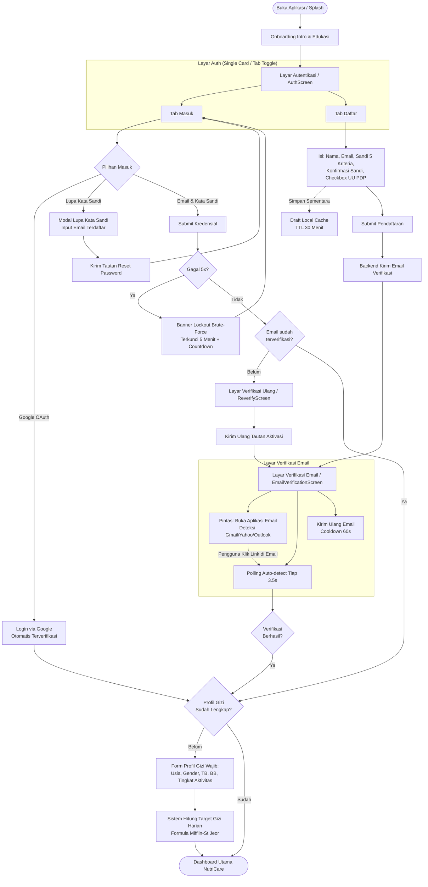
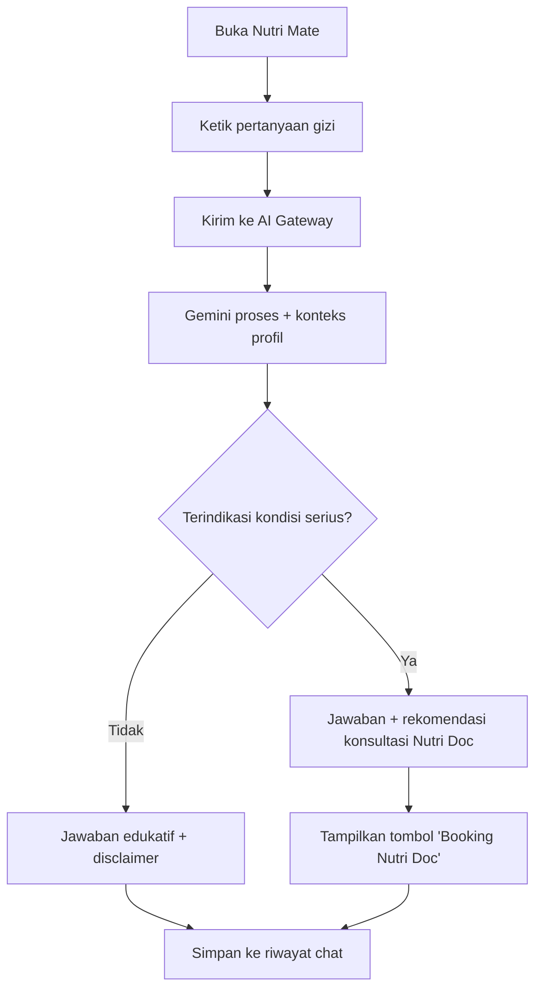
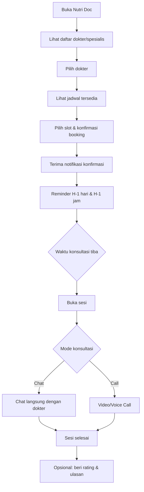
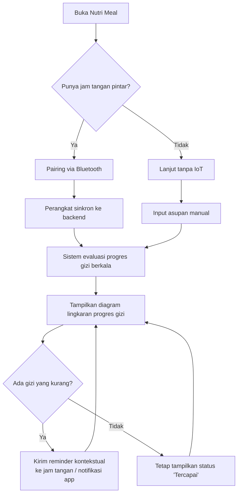
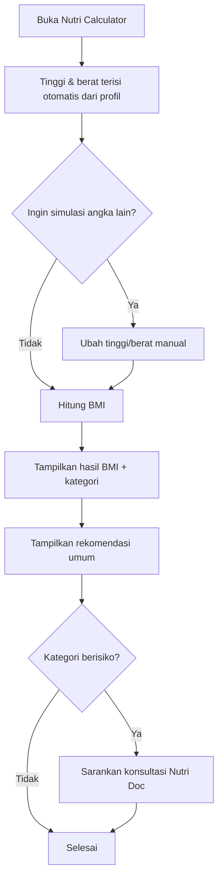
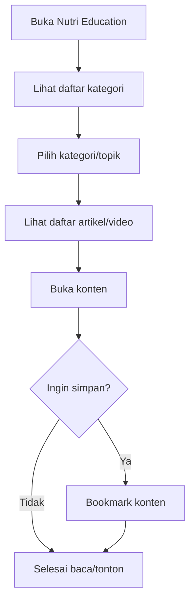
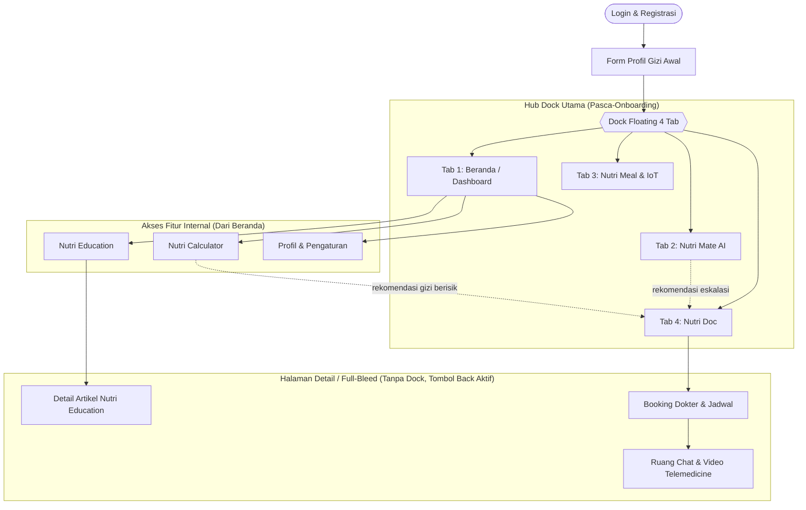

# User Flow — NutriCare

**Versi:** 1.1
**Terkait:** PRD.md, TSD.md, ARCHITECTURE.md, ADAPTASI_SIGAP.md

---

## 1. Flow Onboarding, Autentikasi & Registrasi

## 2. Flow Nutri Mate (Chat AI)

## 3. Flow Nutri Doc — Booking & Konsultasi

## 4. Flow Nutri Meal + IoT

## 5. Flow Nutri Calculator

## 6. Flow Nutri Education

## 7. Flow Navigasi Utama (Overview)

> **Catatan Navigasi & Tombol Back:**
> - **Dock Floating 4 Tab**: Bertindak sebagai hub navigasi utama yang persisten di 4 tab akar (**Beranda**, **Nutri Mate**, **Nutri Meal**, **Nutri Doc**). Fitur Nutri Calculator, Nutri Education, dan Profil diakses langsung dari dashboard/menu internal.
> - **Halaman Detail (Non-Root)**: Saat pengguna masuk ke halaman detail (mis. Baca Artikel, Form Booking, Ruang Konsultasi), halaman di-push menutupi dock (dock tidak tampil).
> - **Tombol Back**: Muncul otomatis di pojok kiri atas **hanya pada halaman non-root** (`canPop`), memungkinkan pengguna kembali ke tampilan sebelumnya. Keempat tab akar tidak memiliki tombol back.
